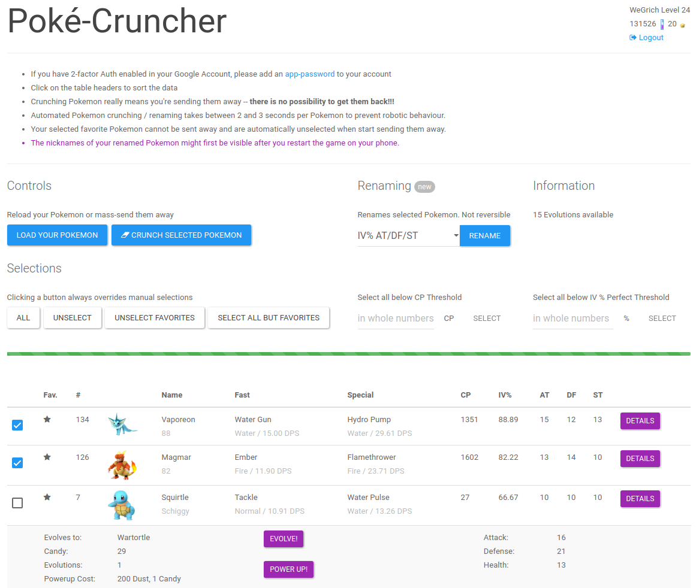

# pogo-cruncher
This tool lets you send away multiple Pokemon at once in Pokemon GO, you can also see all IV Values.  
The tool runs locally on your PC and the Login-Details are not leaving your computer. Feel free to check the source code or contribute.

*This tool is not an official production of Niantic or the Pokemon Company. Use at own risk*



It is a work in progress, so please report all bugs to the issue page.

## Installation Setup for Windows user
You can also use the Linux / MAC OS docker setup, but for unknown reasons it does not work properly for most windows users. So use instructions below.

  1. Install [Python 3](https://www.python.org/downloads/).
    * Check "Add Python3.5 to PATH" during installation.
  2. Download the newest Windows release [here](https://github.com/Wegi/pogo-cruncher/releases).
  3. Unzip the folder.
  4. Open `cmd` or `Powershell`.
  5. Type `cd <C:/Path/to/the/folder>`
  6. Type `pip install -r requirements.txt`
  7. After this finishes you may start the cruncher as follows:

### Windows Startup 
  8. In the application folder type `python app.py`
  9. Now open the index.html in the folder with your preffered browser.

## Installation Setup for Linux / MAC OS with Docker
Requirements:
  * docker

#### Step 1
Install docker and docker-compose. You can find docker, docker-compose, and a installation guide [on the Docker homepage.](https://docs.docker.com/compose/install/)

#### Step 2
Download the newest version of pogo-cruncher.

Either via direct download [here](https://github.com/Wegi/pogo-cruncher/releases) or by using git

```bash
$ git clone https://github.com/Wegi/pogo-cruncher.git
```

#### Step 3
Open a Terminal and enter the pogo-cruncher directory, then do build the app via:
```bash
$ docker-compose build
```

### Run Pogo-Cruncher
Open a Terminal and enter the pogo-cruncher directory, then start the app via:
```bash
$ docker-compose up
```
Now the app is up and running. Access it on [localhost:8888](http://localhost:8888)  
You can stop the app by closing the terminal.


## Setup for dev-users
Requirements:
  * python3
  * bower
  * nodejs
  * sass
  * Clojure

#### Backend
This tool ist based on python and the wonderfull Pokemon GO api at https://github.com/tejado

Start it with this command from the repository's root directory:

```bash
$ python app.py
```


#### frontend
Change directory to `frontend/`:
```bash
$ cd frontend
```

Once get all bower dependencies with:
```bash
$ bower install
```

Build sass files
```bash
$ sass resources/public/css/style.sass resources/public/css/style.css
```

Then start the interactive session:
```bash
$ lein figwheel
```

You can access the application now at [localhost:3449](http://localhost:3449)

## Upcoming Features
    * Automatic Pidgeycalc for Egg-Evolutions
    * Send all dupes away that are not the highest CP
    * Rename Pokemon after their IVs

## Feature Requests
For feature requests please open up a new issue on this repository.
